<!-- ────────────────────────────────────────────────────────────────
     Minseok Kong · GitHub profile
     Banner lives in assets/banner-light.svg + assets/banner-dark.svg
     and adapts to the viewer's color scheme automatically.
     ──────────────────────────────────────────────────────────────── -->

<picture>
  <source media="(prefers-color-scheme: dark)" srcset="assets/banner-dark.svg">
  
</picture>

  
  
  

 

I engineer the loop around the model — agent runtimes, retrieval, memory, and the guardrails that keep AI services honest enough to be trusted with real decisions. Shipping in production at **SK Inc. AX** in Seoul.

I came here by way of economics, then graduate research in computer vision and reinforcement learning — and stayed for the part where models meet production.

### Focus

- **Agent systems** — autonomous loops, deterministic pipelines, tool orchestration
- **Context & memory** — long-term memory, structured knowledge, semantic recall
- **Retrieval** — hybrid search, and generation that stays grounded in evidence
- **Reliability & safety** — failure-mode design, injection defense, hallucination gates

### Publications

- **Simulating Mobile Robot Vision: An Analysis of RGB-D versus RGB-Based Distance Accuracy and CPU Optimization** 
  IEEE ICAIIC 2025 · first author · <a href="https://ieeexplore.ieee.org/document/10920652">IEEE Xplore</a>
- **Empirical Analysis of Automated Stock Trading Using Deep Reinforcement Learning** 
  Applied Sciences (SCIE), 2023 · first author · <a href="https://www.mdpi.com/2076-3417/13/1/633">MDPI</a>
- **Unsupervised Semantic Segmentation Leveraging Masking-Based Feature Reconstruction** 
  M.S. thesis, Sogang University, 2024

### Education

- **Sogang University** — M.S. in Computer Science & Engineering, Applied Big Data Engineering · 2022–2024
- **University of Toronto** — Faculty of Applied Science & Engineering, Applied AI Program · 2024
- **Sogang University** — B.S. in Economics · Big Data Science · 2014–2022

### Toolbox

  
  
  
  
  
  
  
  
  
  

and on the research side —

  
  
  
  

